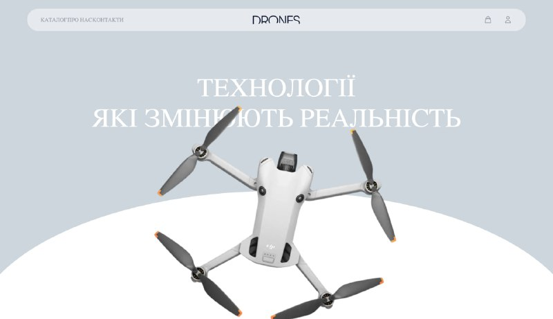

# ShopDrones - Інтернет-магазин дронів



Цей проєкт розроблено з метою ознайомлення із створенням повноцінного веб-застосунку інтернет-магазину з використанням мікрофреймворку [Flask](https://flask.palletsprojects.com/). Проєкт демонструє основні принципи веб-розробки: роботу з базами даних, системою аутентифікації, шаблонізацією, обробкою форм та створенням адміністративної панелі. Застосунок включає каталог товарів, кошик для покупок, реєстрацію користувачів, оформлення замовлень та панель адміністратора.

---

### Зміст репозиторія:

1. [Основні модулі проєкту](#all-modules)  
2. [Розгортання проєкту](#download-project)  
3. [Створення віртуального оточення проєкту](#create-venv)  
4. [Завантаження модулів до віртуального оточення](#download-modules-venv)  
5. [Налаштування середовища](#setup-env)
6. [Старт проєкту](#start-project)
7. [Основні сторінки проєкту](#all-pages)
8. [Структура проекта](#project-structure)
9. [Висновок по проєкту](#result)  

---

### <h4 id='all-modules'>Основні модулі проєкту:</h4>

- [Flask](https://flask.palletsprojects.com/) - мікрофреймворк для веб-розробки
- [Flask-SQLAlchemy](https://flask-sqlalchemy.palletsprojects.com/) - ORM для роботи з базою даних
- [Flask-Login](https://flask-login.readthedocs.io/) - управління сесіями користувачів
- [Jinja2](https://jinja.palletsprojects.com/) - шаблонізатор для HTML
- [SQLite](https://www.sqlite.org/) - легка база даних
- [python-dotenv](https://pypi.org/project/python-dotenv/) - управління змінними середовища


---

### <h4 id='download-project'>Розгортання проєкту:</h4>

#### 1. Склонувати з GitHub

```bash
git clone https://github.com/Nazickj2023/shop_drones.git
cd ShopDrones
```

#### 2. Завантажити як ZIP

- Перейдіть на сторінку GitHub репозиторію
- Натисніть `Code > Download ZIP`
- Розпакуйте архів на своєму пристрої

---

### <h4 id='create-venv'>Створення віртуального оточення проєкту:</h4>

#### Windows

```bash
python -m venv venv
venv\Scripts\activate
```
*Або перегляньте коротке відео:*


#### Mac OS або Linux

```bash
python3 -m venv venv
source venv/bin/activate
```
*Або перегляньте коротке відео:*


---

### <h4 id='download-modules-venv'>Завантаження модулів до віртуального оточення:</h4>

#### За допомогою `requirements.txt`:

```bash
pip install -r requirements.txt
```

#### Окремими модулями (вручну):

```bash
pip install alembic==1.15.2 blinker==1.9.0 click==8.2.0 Flask==3.1.1 Flask-Login==0.6.3 Flask-Migrate==4.1.0 Flask-SQLAlchemy==3.1.1 itsdangerous==2.2.0 Jinja2==3.1.6 Mako==1.3.10 MarkupSafe==3.0.2 python-dotenv==1.1.0 SQLAlchemy==2.0.40 typing_extensions==4.13.2 Werkzeug==3.1.3

```

---

### <h4 id='setup-env'>Налаштування середовища:</h4>

Створіть файл `.env` у кореневій папці проєкту:

```bash
DB_INIT = flask --app Project db init
DB_MIGRATE = flask --app Project db migrate
DB_UPGRADE = flask --app Project db upgrade
```

---


---

### <h4 id='start-project'>Старт проєкту:</h4>

```bash
python app.py
```

Застосунок буде доступний за адресою: `http://127.0.0.1:5000`

---

### <h4 id='all-pages'>Основні сторінки проєкту:</h4>

- **`/`** — головна сторінка з презентацією магазину
- **`/shop`** — каталог дронів з фільтрами та пошуком
- **`/cart`** — кошик для покупок
- **`/authorization`** — сторінка входу користувача
- **`/registration`** — реєстрація нового користувача


---

## Структура проекта

```mermaid
graph TD
    A[ShopDrones] --> A1[cart]
    A1 --> A1a[static]
    A1a --> A1a1[js]
    A1a1 --> A1a1a[addProduct.js]
    A1a1 --> A1a1b[countProduct.js]
    A1a1 --> A1a1c[deleteProduct.js]
    A1a1 --> A1a1d[removeProduct.js]
    A1 --> A1b[templates]
    A1b --> A1b1[cart.html]
    A1 --> A1c[__init__.py]
    A1 --> A1d[apps.py]
    A1 --> A1e[models.py]
    A1 --> A1f[views.py]

    A --> A2[home]
    A2 --> A2a[static]
    A2a --> A2a1[css]
    A2a1 --> A2a1a[home_header.css]
    A2a --> A2a2[icon]
    A2a2 --> A2a2a[drones.svg]
    A2 --> A2b[templates]
    A2b --> A2b1[home.html]
    A2 --> A2c[__init__.py]
    A2 --> A2d[apps.py]
    A2 --> A2e[models.py]
    A2 --> A2f[views.py]

    A --> A3[Project]
    A3 --> A3a[instance]
    A3a --> A3a1[data.db]
    A3 --> A3b[migrations]
    A3b --> A3b1[versions]
    A3b1 --> A3b1a[747714f6c7ef_.py]
    A3b --> A3b2[alembic.ini]
    A3b --> A3b3[env.py]
    A3b --> A3b4[script.py.mako]
    A3 --> A3c[static]
    A3c --> A3c1[css]
    A3c1 --> A3c1a[base.css]
    A3c1 --> A3c1b[footer.css]
    A3c1 --> A3c1c[header.css]
    A3c1 --> A3c1d[logo.css]
    A3c --> A3c2[icon]
    A3c2 --> A3c2a[cart_black.svg]
    A3c2 --> A3c2b[cart.svg]
    A3c2 --> A3c2c[homepage.png]
    A3c2 --> A3c2d[logo.svg]
    A3c2 --> A3c2e[profile_black.svg]
    A3c2 --> A3c2f[profile.svg]
    A3c2 --> A3c2g[shop.png]
    A3c --> A3c3[images]
    A3c3 --> A3c3a[main.jpg]
    A3c3 --> A3c3b[venv_lin.gif]
    A3c3 --> A3c3c[venv_win.gif]
    A3 --> A3d[templates]
    A3d --> A3d1[base.html]
    A3 --> A3e[__init__.py]
    A3 --> A3f[config_page.py]
    A3 --> A3g[db.py]
    A3 --> A3h[loadenv.py]
    A3 --> A3i[login_manager.py]
    A3 --> A3j[settings.py]
    A3 --> A3k[urls.py]

    A --> A4[shop]
    A4 --> A4a[static]
    A4a --> A4a1[images]
    A4a1 --> A4a1a[products]
    A4a1a --> A4a1a1[IPhone 16 Pro Max.png]
    A4a1a --> A4a1a2[IPhone 16.png]
    A4a --> A4a2[js]
    A4a2 --> A4a2a[addProductIdToCookies.js]
    A4 --> A4b[templates]
    A4b --> A4b1[shop.html]
    A4 --> A4c[__init__.py]
    A4 --> A4d[admin.py]
    A4 --> A4e[apps.py]
    A4 --> A4f[models.py]
    A4 --> A4g[views.py]

    A --> A5[user]
    A5 --> A5a[templates]
    A5a --> A5a1[authorization.html]
    A5a --> A5a2[registration.html]
    A5 --> A5b[__init__.py]
    A5 --> A5c[apps.py]
    A5 --> A5d[models.py]
    A5 --> A5e[views.py]

    A --> A6[.env]
    A --> A7[.gitignore]
    A --> A8[README.md]
    A --> A9[manage.py]
    A --> A10[requirements.txt]
```




## 🗄️ Моделі бази даних

### `User` - Модель користувача

```python
class User(DATABASE.Model, UserMixin):
    
    id = DATABASE.Column(DATABASE.Integer, primary_key = True)
    username = DATABASE.Column(DATABASE.String(50), nullable = False)
    email = DATABASE.Column(DATABASE.String(50), nullable = False)
    password = DATABASE.Column(DATABASE.String(25), nullable = False)
    is_admin = DATABASE.Column(DATABASE.Boolean, default = False)
 ```   

### `Product` - Модель товару (дрона)

```python
class Product(DATABASE.Model):
    
    id = DATABASE.Column(DATABASE.Integer, primary_key = True)
    product_name = DATABASE.Column(DATABASE.String(50), nullable = False)
    price = DATABASE.Column(DATABASE.Float, nullable = False)
    discount = DATABASE.Column(DATABASE.Float, nullable = False)
    count = DATABASE.Column(DATABASE.Float, nullable = False)
    description = DATABASE.Column(DATABASE.String(450), nullable = False)

```


---

## 🎨 Frontend / Інтерфейс

### Шаблони (Templates)

- **`base.html`** → Базовий шаблон з навігацією та футером
- **`home.html`** → Головна сторінка з героїчною секцією
- **`shop.html`** → Каталог товарів з фільтрами
- **`cart.html`** → Кошик покупок з можливістю редагування
- **`authorization.html` / `registration.html`** → Форми аутентифікації


### Статичні файли

- **CSS** → кастомні стилі
- **JavaScript** → Інтерактивність кошика 
- **Images** → Зображення дронів та іконки

---

## ⚙️ Основні функції

- 🛒 **Каталог товарів** з пошуком та фільтрацією за категоріями
- 🛍️ **Кошик покупок** з можливістю додавання/видалення товарів
- 👤 **Система реєстрації та авторизації** користувачів
- 📱 **Адаптивний дизайн** для мобільних пристроїв
- 💾 **Збереження даних** в  базі даних

---

### <h2 id='result'>Висновок по проєкту:</h2>

**ShopDrones** — це повноцінний веб-застосунок інтернет-магазину дронів, створений з використанням сучасних веб-технологій на базі Flask фреймворку.

Цей проєкт є відмінним прикладом для вивчення та практики ключових навичок веб-розробника:

- 🌐 Створення веб-застосунків з використанням **Flask**
- 🗃️ Робота з базами даних через **SQLAlchemy **
- 🔐 Реалізація системи аутентифікації з **Flask-Login**


---

## 🚀 Потенціал для розвитку

Цей застосунок можна використовувати як базову платформу для створення будь-якого інтернет-магазину. Його легко розширити за рахунок:

- інтеграції платіжних систем (Stripe, PayPal),
- додавання системи відгуків та рейтингів,
- реалізації програми лояльності,
- інтеграції з API служб доставки,
- додавання багатомовної підтримки,
- оптимізації для пошукових систем (SEO),
- створення мобільного API для додатків.

---

## 🏆 Результати

Під час реалізації проєкту було отримано цінний практичний досвід створення повноцінного комерційного веб-застосунку — від планування архітектури до реалізації всіх ключових функцій інтернет-магазину, включаючи роботу з базою даних, аутентифікацію користувачів та адміністративну панель.

---
